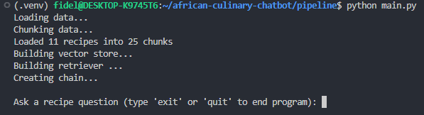

# African Culinary RAG Assistant

## Project Overview
The African Culinary RAG Chatbot is an AI-powered, recipe discovery chatbot that helps users 
explore, query, and retrieve African recipes with their ingredients, steps, and nutritional 
information. It uses a **Retrieval-Augmented Generation (RAG)** approach to combine semantic search 
over a curated recipe dataset with a Large Language Model (LLM) for context-aware answers.

Users can ask questions like _“How do I cook Egusi Soup?”_ or _“What ingredients do I need for Jollof Rice?”_ 
and receive both a natural language answer and the relevant recipe context.

## Table of Contents
- [Tech Stack](#tech-stack)
- [Installation & Setup](#installation--setup)
    - [Pre-requisites](#pre-requisites)
    - [Setup Instructions](#setup-instructions)
- [Basic Usage](#basic-usage)
    - [Streamlit Application](#streamlit-application)
    - [CLI Application](#cli-application)
- [Project Structure](#project-structure)
- [Example Queries and Answers](#example-queries-and-answers)
- [Known Issues](#known-issues)
- [Acknowledgement](#acknowledgement)
- [License](#license)

## Tech Stack
- **Backend (AI)**: LangChain, HuggingFace Embeddings, ChatGroq
- **Frontend**: Streamlit
- **Data**: JSON recipes dataset of African cuisine, collected from recipes websites.

## Installation & Setup
### Pre-requisites
- Python 3.10 or above
- [Groq API Key](https://console.groq.com/keys)

### Setup Instructions
1. Clone the repository:
```bash
git clone https://github.com/Fidelisaboke/african-culinary-chatbot.git
cd african-culinary-chatbot
```

2. Create a Python virtual environment:
```bash
python3 -m venv .venv
source .venv/bin/activate  # Linux / macOS
.venv\Scripts\activate     # Windows
```

3. Install Dependencies:
```bash
pip install -r requirements.txt
```

4. Set environment variables
- Copy `.env.example` to `.env`:
```bash
cp .env.example .env
```
- Set environment variables listed in the `.env` to your secret environment values.

- Alternatively, create the `.streamlit/secrets.toml` file:
```bash
mkdir .streamlit
touch .streamlit/secrets.toml
```
- Add the Groq API Key and model name to the TOML file:
```bash
GROQ_API_KEY = "your-api-key"

# GROQ Model - The app uses the one set by default
GROQ_MODEL_NAME = "llama-3.3-70b-versatile"
```

## Basic Usage
### Streamlit Application
1. Run the app:
```bash
streamlit run app.py
```
2. Click on the link displayed on the terminal to open the app in your browser.

3. Browse recipes from the sidebar using the dropdown menu.

4. Ask questions in the main input box about recipes, ingredients, or steps.

5. View answers generated by the RAG assistant, along with retrieved recipe sources.

### CLI Application
1. Run `pipeline/main.py`:
```bash
python -m pipeline.main
```
- On running the file, the RAG pipeline will be initiated. This will take a few moments.
- Once it's complete, the prompt will be displayed:


2. Type a recipe question as prompted and hit **Enter**. An answer to your question will be generated:


3. Type **exit** or **quit** to close the terminal app.

## Project Structure
```bash
.
├── .gitignore
├── README.md
├── app.py                      # Streamlit app
├── data
│   └── african_recipes.json    # Recipes dataset
└── pipeline
    ├── __init__.py
    ├── chain.py                # RAG chain creation
    ├── chunking.py             # Text splitting into chunks
    ├── indexing.py             # Vector store setup
    ├── main.py                 # CLI app
    ├── recipes_loader.py       # Recipe loader
    ├── retrieval.py            # Retriever setup with reranking
    └── utils.py                # Helper functions
└── vectors
    └── chroma_db               # Persisted Chroma vector store
```

## Example Queries and Answers
- **Query**: “How do I prepare Egusi Soup?”

**Answer**: Returns Step-by-step instructions with ingredients and cooking steps.

- **Query**: "What are the ingredients for making Lasagna?"

**Answer**: Returns a response explaining that the context does not mention Lasagna (Currently, lasagna is not present in the dataset.)

- **Query**: "Which dish should I make for a family of 8?"

**Answer**: Returns a relevant recipe, based on the servings count of 8 (e.g. Jollof Rice in the dataset)

## Known Issues
- Ingredients, steps, or nutrition information may be missing for some recipes.
- The system may return multiple similar recipes due to chunk-based retrieval.
- Nutritional information is optional and not always complete.
- Currently supports only the African recipes provided within the dataset.

## Acknowledgement
I would like to thank [NSK.AI](https://www.nskai.org/) for the RAG bootcamp, which taught me the skills to build this project.

I would also like to thank the contributors and developers of the tools and resources used in this project:
- [LangChain](https://www.langchain.com/) - for RAG and embeddings utilities
- [HuggingFace](https://huggingface.co/) - for embeddings and cross-encoder models
- [Streamlit](https://streamlit.io/) - for the interactive UI
- African cuisine recipe contributors on [Allrecipes](https://www.allrecipes.com/) and other recipe websites

## License
This project is licensed under the MIT License. See the [`LICENSE`](./LICENSE) file for details.
